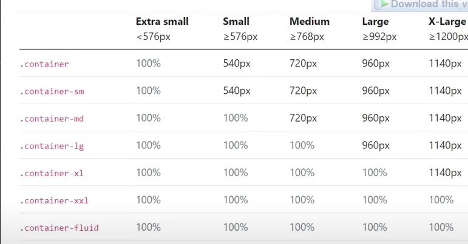
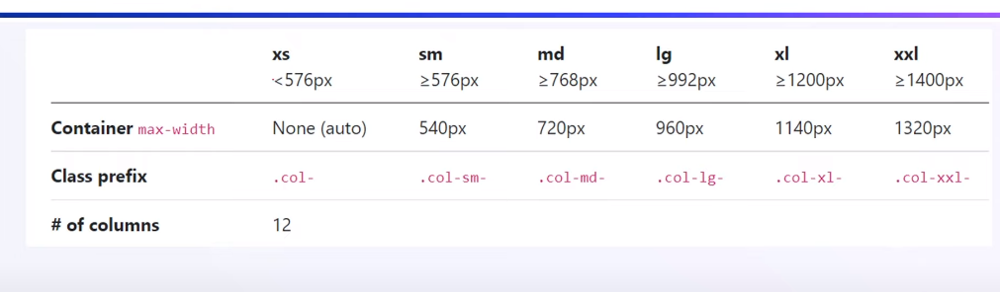

# `Bootstrap` 

**<span style="color:red; font-size:19px;">Bootstrap is the combination of Html css and javascript , it is a framework for frontend developer.</span>**

**<span style="font-size:15px;">Bootstrap 5 is open to use</span>**

***In bootstrap 5 Jquery is completely removed and now bootstrap 5 will work according to javascript that makes bootstrap simple to use,Bootstrap currently use Vanila javascript***


## Breakpoint
<div style="color:yellow; font-size:15px">

```
1.**x-small None <576 for mobile**<br>
2.**small sm  >=576**<br>
3.**medium md >=768px**<br>
4.**Large lg >=992px**<br>
5.**Extra-large xl >=1200px**<br>
```
mostly our website use 1170px
</div>

## Container Classes


<div style="color:tomato;font-size:15px;">

1. mobile screen .container  width =100%
2. 

</div>

## container example



<hr color="red" size="10px">

## Grid Options
```1. Extra small (xs)
2. Small (s)
3. Medium (md)
4. Large (lg)
5. Extra large (xl)
6. Extra extra large (xxl)
```



<hr color="red">

**Bootstrap kisi bhi div ko 12 columns me divide kar deta hai**

***.col,.col-sm,.col-md,.col-lg,.col-xl,.col-xsl<br>
every div will get 12
classes*** 

```
<div class="container-fluid">
            <div class="container">
               
                <div class="row">
                    <div class="col-lg-3 col-md-6 col-6">Hello </div>
                    <div class="col-lg-3 col-md-6 col-6">Hello 2</div>
                    <div class="col-lg-3 col-md-6 col-6">Hello 3</div>
                    <div class="col-lg-3 col-md-6 col-6">Hello 3</div>
                </div>
            </div>
    </div>
```
## Auto Column Website


**IS type ke column ke liye 
use hoge vaha 12 colums ke according adjust nahi kar sakte**


